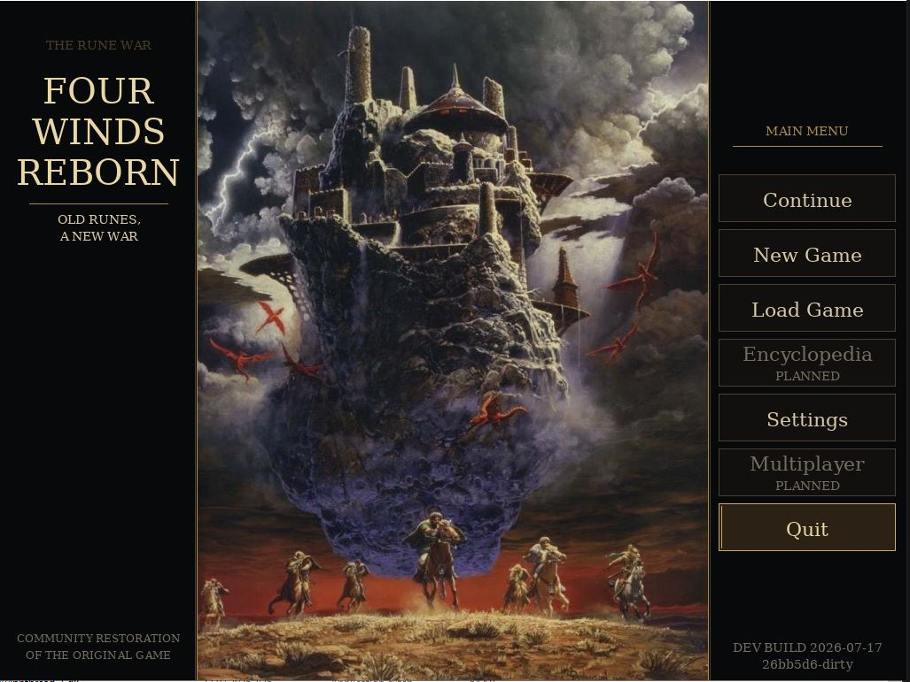
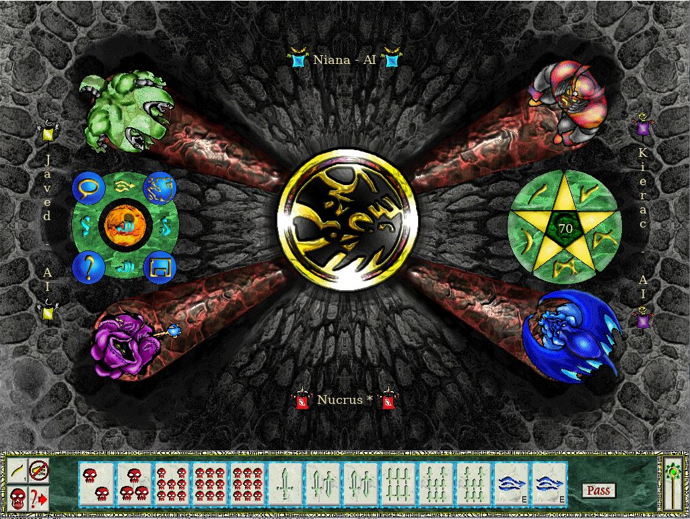
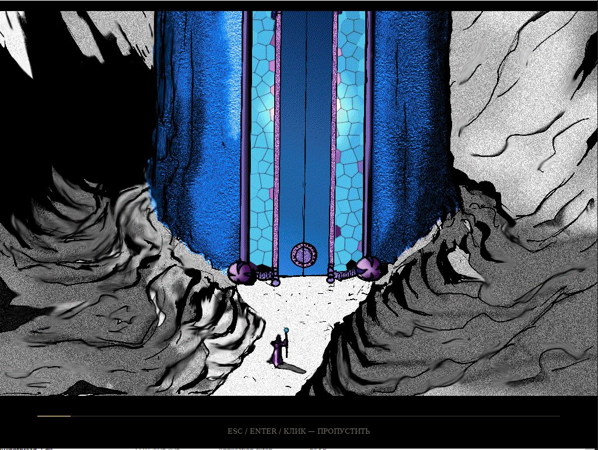
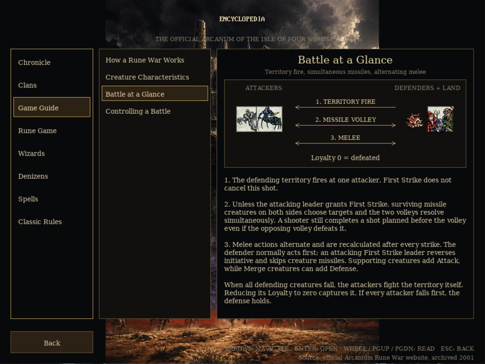

# Four Winds Reborn

Community continuation of the retro strategy game *The Isle of Four Winds:
Rune War*, focused on completing its unfinished systems, restoring the original
presentation and making the game comfortable on modern platforms.

This project continues
[RuneWars: New Age](https://github.com/AndreyBarmaley/runewars.newage). Original
copyright notices and the GPL-3.0 license are preserved. The bundled
[Four Winds Engine](https://github.com/jaskes/four-winds-engine) retains its
LGPL-3.0-or-later license and upstream attribution.

## Download

The latest stable release is
[Four Winds Reborn v0.2.0](https://github.com/jaskes/four-winds-reborn/releases/latest),
with ready-to-run Windows, Linux and macOS x64 archives plus SHA-256 checksums.
On Windows, unpack the archive and launch `four-winds-reborn.exe`.

## Roadmap

- Make Easy, Normal and Hard play deliberately differently, then validate the
  result over deterministic match cohorts.
- Add development tools for AI takeover, fast-forwarding and reproducible
  near-end scenarios so long games can be tested quickly.
- Improve battle explanations, training and replay viewing while incrementally
  splitting the largest gameplay files into ruleset-ready modules.
- Add versioned themes and mod support, including a legally distinct optional
  art, music and naming set.
- Ship an Android build with native touch controls, safe app lifecycle handling
  and compatible saves.
- Add local Duel and Coalition rulesets, followed by additional Rune Game rules
  through a shared versioned ruleset contract.
- Add authoritative multiplayer last, after the platforms and local rulesets
  are stable.

## Screenshots

### Main menu



### Rune table



### Restored story intro



### Encyclopedia and game guide



## Highlights

- A complete main menu with new game, continue, named saves, recovery and
  persistent settings.
- English and Russian interface, terminology, buttons, narration and restored
  original voice resources.
- Windowed and fullscreen modes with smooth fixed-canvas scaling.
- Independent music, effects and voice volume controls, plus Classic, Normal
  and Fast presentation speeds.
- Restored story intro and separate menu, faction, map and summary music.
- Easy, Normal and Hard AI, distinct wizard behavior profiles and improved
  Mahjong, spell, summon, map and battle decisions.
- Manual tactical battles with legal target selection, AI recommendations and
  optional automatic resolution.
- A bilingual Encyclopedia covering lore, factions, wizards, creatures, spells,
  classic rules and a practical illustrated Rune Game guide.
- Numerous crash, save, Rune Game, UI, localization, map input and invisible
  rune fixes inherited from years of unfinished development.

## Build from source

Clone the game with its engine submodule:

```bash
git clone --recurse-submodules https://github.com/jaskes/four-winds-reborn.git
cd four-winds-reborn
```

On Linux or macOS:

```bash
./scripts/build.sh --install-deps
```

On Windows, install [MSYS2](https://www.msys2.org/) and run:

```powershell
.\scripts\build-windows.ps1 -InstallDeps
```

## Documentation

- [Changelog](CHANGELOG.md)
- [Battle and Adventure rules](docs/BattleAndAdventureRules.md)
- [Spell lifecycle](docs/SpellLifecycle.md)
- [Localization and source provenance](docs/Localization.md)
- [Preserved Arcanium archive material](docs/ArcaniumArchive.md)
- [Balance laboratory](docs/BalanceLab.md) and
  [current balance tiers](docs/BalanceTiers.md)
- [Branch and release process](docs/ReleaseProcess.md)

## License and attribution

Four Winds Reborn preserves the original project credits and GPL-3.0 license.
The Four Winds Engine submodule is LGPL-3.0-or-later. This repository documents
Reborn changes without claiming authorship of inherited code or game assets.
